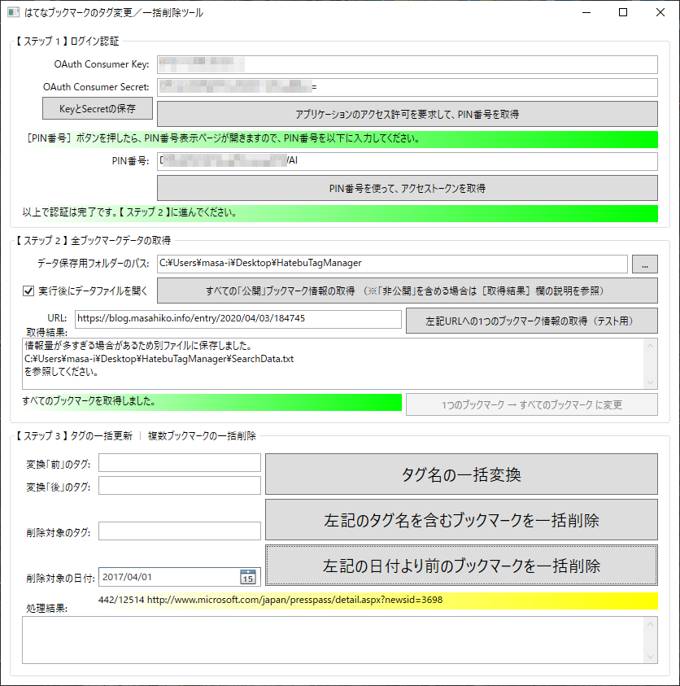

HatebuTagManager
====================================

- 公式解説ページ： [はてブのタグを一括編集、タグ名や日付で一括削除するためのツール「HatebuTagManager」 - いっしきまさひこBLOG](https://blog.masahiko.info/entry/2020/04/03/184745)
- 以下はリポジトリ紹介のため、上記リンク先と同じ内容を掲載しています。

はてなブックマークの「**タグ**の **一括** **編集**（タグの **置換** ／ **変更**）」「**タグ名**による **一括** **削除**」「**日付**による **一括** **削除**」の3機能を提供するWindowsアプリです。簡単な操作で使えます。※非公開ブックマークにも対応しています！

※注意事項： 本ツールの使用によって、何が起こっても無補償です。作者は一切の責任を負いません。自己責任でお願いします。ご了承のうえで本ツールをご使用ください。もちろんツール作者自身も本ツールを使っていますので、そんな大変なトラブルは起きないとは思いますが。

目的
-------------------------------------------------------------------

かつて「はてなブックマーク」ではタグの一括置換機能が提供されていましたが、あまり使われなかったためか、機能が廃止されてしまいました。そこで「タグ一括置換」を行うための簡単操作ツール（Windowsアプリ）を作りました。

さらに、指定タグ名が含まれるブックマークを一括削除したり、指定日より前のブックマークを一括削除したりするための機能も、このツールに搭載しました。

（ちなみに最初に作り始めたのは2019年7月でしたが、2020年4月に行ったタグ整理をきっかけに、全機能を完成させました。）

ユースケース（用途）
-------------------------------------------------------------------

- 例えば、ツールや製品などの名前が変わったために、タグの名前も変えたい　→　［タグ一括置換］
- 例えば、一度つけた名前がしっくりこなくて、後悔している　→　［タグ一括置換］
- 例えば、技術が廃れたり製品がなくなったりしたため、タグごとブックマークもなくしたい　→　［タグ名による一括削除］
- 例えば、ジョブチェンジや趣味の変化などの理由で、（タグ一覧で存在感が大きすぎる）以前のタグの存在感を弱くしたい　→　［タグ名による一括削除］
- 例えば、5年以上前のブックマークは見返すことはないので、直近数年を残してブックマーク全体をリセットしたい　→　［日付による一括削除］
- 例えば、ブックマークが大量すぎて、全体が把握しづらいので、とにかく数を減らしてスリム化したい　→　［日付による一括削除］

以上のような用途が考えられます。こういった用途に合致するのならば、以下の事前準備と使い方の方法でぜひツール「HatebuTagManager」を使ってみてください。

事前準備
-------------------------------------------------------------------

- このツールは「[はてなブックマーク REST API](http://developer.hatena.ne.jp/ja/documents/bookmark/apis/rest)」を使っています。その認証方法は、OAuthのみとなっており、Consumer keyとSecretが必要です。
- Consumer keyとSecretは、公式ページ「[OAuth ではてなのサービスにアクセスする - はてな](https://www.hatena.ne.jp/misshiki/config/auth/develop)」で取得してください。
- ［新しいアプリケーションの追加］ボタンを押すだけです。次に表示される登録ページ内の［キー］欄に、Consumer KeyとSecretは記載されています。
- 登録ページ内の［承認を求める操作］欄で、下記の4つにチェックを付けて、一番下の［変更する］ボタンを押せば完了です。
  - `read_public` …… 公開情報の読み取り
  - `write_public` …… 公開情報の読み取りと書き込み、削除
  - `read_private` …… プライベート情報を含む情報の読み取り
  - `write_private` …… プライベート情報を含む情報の読み取りと書き込み

「HatebuTagManager」の使い方
-------------------------------------------------------------------

- ツール「HatebuTagManager」の最新バージョンは、［[Releases](https://github.com/isshiki/HatebuTagManager/releases)］から「HatebuTagManager.～.zip
」ファイルをダウンロードしてください。その.zipファイルを展開して、フォルダー内の`HatebuTagManager.exe`ファイルを実行してください（Windows 10専用です）。

- 上から順番に、各入力欄に適切な内容を入力し、ボタンを押していってください。
- ※［……（テスト用）］と書かれているボタンは、指定URLのブックマークを**1つだけ**処理する用です。**一括**処理時は、このボタンを押す必要はありません。
- 【 ステップ 2 】では、
  - 「公開」ブックマークのみの場合： ［すべての「公開」ブックマーク情報の取得］ボタンをクリックしてください（手軽）。
  - 「公開＆非公開」全ブックマークを取得したい場合： [はてなブックマーク公式のエキスパートページ](https://b.hatena.ne.jp/-/my/config/data_management) から、ブックマーク形式のデータファイルをダウンロードして、ツール上にドラッグ＆ドロップしてください（お勧め）。詳しくは後述します。
上記の3機能に対応するボタンがあります。
- 【 ステップ 3 】に、上記の3機能に対応するボタンがあります。
- 【 ステップ 3 】の処理中に実行を**どうしても**止めたくなった場合は、右上の［×］ボタンをクリックしてください。
  - ※ただし、これは強制終了でアプリを閉じることになり、アプリが閉じられる直前に強制的に「途中まで実施済みの結果ログの出力」が実行されます。
- 【 ステップ 3 】の3機能を実行した後で、続けて【 ステップ 3 】の3機能をさらに実行したい場合は、【 ステップ 2 】の［すべてのブックマーク情報の取得］ボタンを押して、全ブックマーク情報をリセットしてから行ってください。
  - ※最新のブックマーク情報を取得し直す必要があります。

「公開＆非公開」全ブックマークを取得する方法
-------------------------------------------------------------------

非公開のブックマークを含めて全ブックマークを取得するためのAPIは提供されていません。そのため、ユーザーの方で全ブックマークをエクスポートとして、それを本ツール「HatebuTagManager」にインポートする必要があります。インポート方法は、ドラッグ＆ドロップのみサポートしています。手順は以下のとおりです。

- 公式ページ「[はてなブックマーク - 設定 - データ管理](https://b.hatena.ne.jp/-/my/config/data_management)」

　上記の公式ページにアクセスしてください。

このようにして、 `<ユーザーID>.bookmarks.html` ファイルをダウンロードしたら、本ツールの【 ステップ 1 】を実行した後で【 ステップ 2 】として、そのファイルをツール上にドラッグ＆ドロップしてください。

すぐに全ブックマーク情報が読み込まれます。次に【 ステップ 3 】の実行に進んでください。

【注意点】実行時間の表示について
-------------------------------------------------------------------

置換／削除前に、ざっくりとした概算時間をメッセージボックスで表示しますが、あくまで予測であり、正確ではありません。特に「公開」ブックマークで「日付による一括削除」の場合、個々のブックマーク情報を取得しないと日付がチェックできないために、「最長時間」の予測表示になっています（※「公開＆非公開」全ブックマークを取得した場合は、「日付による一括削除」でもブックマーク数で予測します）。

はてなブックマークAPIへの処理負荷を軽減するため、5～6秒に1処理ぐらいのペースで処理を行います（※サービス提供側への配慮です）。よって最低でも、100件で9分、1000件で1時間24分、10000件で14時間はかかる計算になります。使わないPCなどでずっと実行したままにするような形で使ってください。12時間以上かかりそうな場合は、（後述のTIPSを参考に）全削除して新たにブックマークを開始した方がよいかもしれません。

※本ツールは分散同時実行には対応していないため、ツールを複数箇所で同時に実行することもしないでください。

【注意点】一括削除時のエラーについて
-------------------------------------------------------------------

はてなブックマークのリンク先がない場合など、「はてなブックマーク REST API」内部で何らかのエラーが起きやすいようです。本ツール側では対処のしようがありません。主に404エラーが出るページや、リダイレクト設定がされているページ、不要なクエリパラメーターが多数含まれているページで、このエラーが起きているようです。

エラーが起こったブックマークは、処理結果後のログファイルに記載されています。そのブックマークリンクを開いて、**手動で**置換／削除処理をしてください。基本的な手順を紹介しておきます。

（2）はてなブックマークのユーザー数（1 user）をクリックしてください。ゴミ箱ボタンをクリックしても、APIと同じで削除できない現象を確認しています。

これによってブックマークページが表示されるはずですが、次のように表示された場合はすでに削除済みです。

削除していない場合は次のように表示されるはずです。ここでゴミ箱ボタンをクリックします。

これによって削除され、［ブックマーク］ボタンが表示されるはずです。

日付順で最も古いものにアクセスするには、「<https://b.hatena.ne.jp/(user-id)/bookmark?page=156>」のようなURLでページ番号を指定して最後のページを探せばよいです。取りこぼし分は、ここから手動で削除していくこともできます。※作者確認では、どうしても削除できない項目がありました。はてなブックマーク運営会社に問い合わせてみましたが、やはり「調査の結果、ユーザー側ではできない」とのことで、運営会社側で削除してもらうことができました。

エラーの種類によっては、【 ステップ 2 】と【 ステップ 3 】の一連の処理を何度か繰り返すことで、何とかAPI内部で処理してくれる場合があることを確認しています。必要に応じて、お試しください。

【TIPS】はてなブックマークの全削除
-------------------------------------------------------------------

はてなブックマークの全削除機能は、公式に提供されています（情報源「[ブックマークの全削除機能の提供を再開しました - はてなブックマーク開発ブログ](https://bookmark.hatenastaff.com/entry/2020/01/22/165413)」）。

- [はてなブックマークの全削除機能（データ管理ページ）](https://b.hatena.ne.jp/-/my/config/data_management)

上記URLにアクセスし、［ブックマークの全削除］欄の［削除を進める］ボタンをクリックするだけです。

本ツールの開発について
-------------------------------------------------------------------

このツールは無料ですし、あくまで個人の時間で簡易的に（1日ぐらいで）作成したものです。よってas-is（ありのままの状態）での提供とします。

［[Issues](https://github.com/isshiki/HatebuTagManager/issues)］に質問や不具合の報告をすることは可能です。ただし、上記の理由でこのツール開発に対する作者個人の優先度は低く、対応はあまり期待できないとお考えください。

［[Pull Requests](https://github.com/isshiki/HatebuTagManager/pulls)］も受け付けます。時間があるときには対応します（数カ月～年単位の場合があります）。また、「積極的に開発したい」という方がいらっしゃれば、collaboratorとして招待しますので、何らかの手段でお知らせください。

ライセンス
-------------------------------------------------------------------

- MITライセンス
